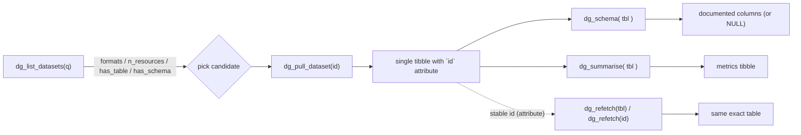

# Design proposal — discovery-first refresh

Reframed primary goal: *let students/data scientists find a dataset matching
their interests, judge whether it is usable, fetch it, and re-fetch the exact
same table reproducibly.*

Current public API: `dg_list_datasets(q, n, format, schema_only)`,
`dg_pull_dataset(id, all_files, remove_na)`, `dg_refetch(x, remove_na)`,
`dg_table_id(x)`, `dg_schema(x)`, `dg_summary(x, name)`,
`dg_summarise(datasets, n)`. (All functions share the `dg_*` prefix;
`dg_download_many()` was removed — its role is covered by
`dg_pull_dataset()` + `dg_summarise()`.)

## Target flow



---

## Baseline (agreed): stable per-table ID + re-fetch

### 1.1 Composed table id encoding (URI form)

Each parsed table gets a stable, parseable, globally unique address — a URI:

- Single-file resource:
  `https://www.data.gouv.fr/datasets/<dataset_id>#<resource_id>`
- File inside a multi-file ZIP:
  `https://www.data.gouv.fr/datasets/<dataset_id>#<resource_id>/<file>`

`dataset_id` is a 24-hex ObjectId; `resource_id` is a UUID; `file` is the base
name. The base is data.gouv's own dataset page, so the address is href-able and
opens the right page in a browser, while the fragment carries the two stable
platform identifiers (`#` and `/` never appear in those fields, so the fragment
is unambiguous). This is the platform's own identity, so it is stable and
re-fetchable, unlike filenames. *(An earlier design used a `<dataset_id>::
<resource_id>(::<file>)` delimiter form; the implementation now composes URIs,
and `parse_table_id()` still accepts the legacy `::` form for backwards
compatibility.)*

### 1.2 Store the ID as a table attribute (`dg_pull_dataset`)

Each tibble returned by `dg_pull_dataset()` carries its composed ID as an `id`
**attribute** (added by the internal `table_attr()`), *not* a per-row column.
Injected in `dg_pull_dataset()` *after* `read_resource()`/`format_tibble()`, so
the low-level parsers stay untouched.

- Single resource: the returned table gets the URI for `dataset$id` +
  `resource$id` (`compose_table_id(dataset$id, resource$id)`).
- Multi-file ZIP: by default the first parseable file is returned as a single
  tibble (`compose_table_id(dataset$id, resource$id, <file>)`);
  `all_files = TRUE` returns one tibble per parseable file, each with its own
  URI.

The new exported getter `dg_table_id(x)` reads the attribute and returns `NULL`
for an ordinary data frame. Because the id is an attribute, not a column, it
**cannot** inflate `n_vars`/`n_numeric`/`n_non_numeric`/`prop_missing` in
`dg_summary()` — no exclusion hack is needed (the old `.id` column design
required one).

**Attribute survival.** On the tibbles this package returns, the `id` attribute
survives row/column verbs (`dplyr::select`, `filter`, `mutate`, `slice`,
`arrange`, `rename`, `distinct`, `head()`, base `[`) because `[.tbl_df` keeps
extra attributes. It is dropped only by verbs that build a structurally
different table (`pivot_longer`, `nest`, `summarise`) — the intended behaviour,
since those objects are no longer the same logical table. After a drop,
`dg_table_id()` returns `NULL` and `dg_refetch()`/`dg_schema()` raise a clear
"carries no table id" error.

### 1.3 `dg_refetch(x, remove_na = FALSE)` — new export

```r
dg_refetch(x, remove_na = FALSE)
```

Re-fetch the exact table addressed by a table id (URI) and return **one
tibble** (the id addresses a single table, not a multi-file list). `x` may be a
table returned by `dg_pull_dataset()`/`dg_refetch()` (its `id` attribute is read
by `resolve_table_id()`) or a bare id string — the canonical URI or, for
backwards compatibility, the legacy `::` composed id.

Steps:
1. `resolve_table_id(x)` → table id string (the URI).
2. `parse_table_id(id)` → `dataset_id` (+ optional `resource_id` + `file`).
3. `fetch_dataset(dataset_id)`.
4. Locate the resource by `resource_id`; error if absent.
5. Read it; if a `file` segment is present, unpack the ZIP and parse **only
   that file** (`read_one_zip_file(zip, file)`); otherwise
   `read_resource(resource)`.
6. `format_tibble(..., remove_na)`, re-attach the `id` attribute, and return a
   single tibble.

Validation: `resolve_table_id()` errors on anything that is neither a table with
an `id` attribute nor a bare id string; `parse_table_id()` rejects malformed ids
(wrong segment count / non-hex dataset id) with a clear message.

---

## Discovery improvement 1: usable-at-a-glance search

`dg_list_datasets()` currently keeps only title/id/description/slug and
**discards `resources`**, so students can't tell whether a hit holds a real
table. Fix: keep the `resources` metadata and derive a compact availability
summary.

New columns on the returned tibble:

- `n_resources` — number of resources (integer; `0` when none).
- `formats` — comma-joined, de-duplicated, uppercase formats of the dataset's
  resources, e.g. `"CSV, ZIP"`, or `"—"` when none. (Reuse `supported_formats()`.)
- `has_table` — logical: `TRUE` if any resource is directly parseable (non-ZIP
  supported format). A ZIP is a *maybe*, so it is shown under `formats` but does
  not by itself set `has_table`.

Adding these makes `dg_list_datasets(q = "vélo", n = 20)` immediately answer
"which of these can I actually open?" before spending a download.

**Lightest-file preference (pull side).** When a dataset offers the *same table*
in several formats (same base file name, different extension), the pull path
(`read_first_parseable_resource()`) reduces those candidates to the one with the
smallest advertised `filesize` (`prefer_lightest_file()`), so `dg_pull_dataset()`/
`dg_refetch()` download the lighter copy — e.g. a `data.csv` rather than a
heavier `data.xlsx` twin. Resources with distinct names keep their declared
order, so distinct tables are never silently swapped.

Note: `fetch_datasets_page` requests a **single** `format` value per query (the
API honors only one, so passing several is *not* an OR). `fetch_all_datasets()`
queries each requested format separately and unions/de-duplicates by dataset id,
and `dg_list_datasets(format = ...)` lets the caller choose which formats to
keep (defaults to the full tabular set). The resource-level formats are still
surfaced as the `formats` column.

## Discovery improvement 2: summarise a search result set

Close the preview loop so students can see rows/variables/missingness across
all matching datasets.

**`dg_summarise()` gains an accepted input:** a data-frame returned by
`dg_list_datasets()` (recognized by its `id` column, which is already present).
Then `dg_summarise(dg_list_datasets(q = "vélo"))` pulls and summarizes
every hit in one call. Character-vector and named-list inputs keep working.

This complements (rather than replaces) the existing `NULL`/default behaviour.

---

## Optional / low priority

- **`dg_pull_dataset()` accepting a search term** — convenience alternative to
  `dg_list_datasets(q) |> ...`; only if we want the pull to own search.

---

## Main API vs tabular API: division of labour

Answering "is the main API even useful if the tabular API also serves the
data?": **yes — the main API is the backbone; the tabular API is a
variable-metadata supplement.** They are not substitutes.

| Concern | Main API (`www.data.gouv.fr/api/1`) | Tabular API (`tabular-api.data.gouv.fr`) |
|---------|-------------------------------------|------------------------------------------|
| **Keyword search over the catalog** | ✅ `dg_list_datasets(q)` server-side search | ❌ keyed only by resource UUID; no catalog search |
| **Discovery metadata** (title, org, license, frequency, temporal/spatial, description, formats, sizes) | ✅ | ❌ only `dataset_id` link + table profile |
| **Per-column info** (types, formats, stats) | ❌ absent from payloads | ✅ `/resources/{rid}/profile/` + `/swagger/` |
| **Serving the table** | raw file URLs (`static.data.gouv.fr`) | ✅ `/resources/{rid}/data(.csv|.json)/` with filter/paginate/sort |
| **Coverage** | every resource on the platform | only resources indexed by the tabular service (unindexed → **404**) |
| **Non-CSV support** | ✅ own parsing (TSV, TXT, XLSX, JSON, ZIP) | CSV-oriented pipeline |

Implications for this package:

- `dg_list_datasets(q)` remains irreplaceable: the tabular API has no keyword
  search, and discovery metadata (is this dataset about my interest?) comes
  only from the main API. The educational core rests on the main API.
- The pull path (`read_resource`) keeps downloading raw files itself. That
  preserves full format/coverage (xlsx, json, zip; resources the tabular
  service hasn't indexed), which the tabular API cannot guarantee.
- The tabular API's unique value is **variable metadata at pull time**, which
  the main API lacks. In practice this package sources that metadata from the
  producer's schema documents on schema.data.gouv.fr (see below) rather than
  the tabular service's `/profile/` endpoint; the tabular service is not used
  by the current implementation.
- Keying lines up with the ID design: the tabular API is addressed by
  `resource$id` (a UUID), and its profile carries `dataset_id`, so a composed
  table id maps straight onto the `dataset_id`/`resource_id`/`file` triple
  encoded in the id URI.

---

## New phase: variable/profile pull (via schema.data.gouv.fr)

`dg_schema(x)` — documented column metadata for a single table address.

- Input: a table returned by `dg_pull_dataset()`/`dg_refetch()` (its `id`
  attribute is read via `resolve_table_id()`), or a bare table id string (URI
  or legacy `::` composed id).
- Implementation: data.gouv attaches a schema only as a *pointer* (`resource$schema
  = {name, url, version}`). `dg_schema()` resolves the pointer — the `url`
  directly, or the `name` via `resolve_schema_url()` against
  `schema.data.gouv.fr` — to a Table Schema document and returns its `fields`
  as a tibble of `name`, `title`, `description`, `type`, `example`, with the
  schema's `title`/`name` as attributes. *(An early sketch targeted the tabular
  API `/resources/{rid}/profile/` endpoint; the implementation instead reads
  documented fields from schema.data.gouv.fr, which is where producer-written
  per-column descriptions actually live.)*
- Returns `NULL` (with a message) when the resource declares no schema pointer,
  and errors when the resource is not found or the id is malformed.

---

## File-level change map

| File | Change |
|------|--------|
| `R/utils.R` | `read_zip_resource()` unchanged; add `read_one_zip_file(zip, file)`; id helpers `compose_table_id()` / `parse_table_id()`, `table_attr()` / `table_id_from_attr()` / `resolve_table_id()`; `prefer_lightest_file()` reduces same-data multi-format candidates to the lightest copy. |
| `R/dg-pull-dataset.R` | `dg_pull_dataset()` returns a single tibble (first parseable file of a ZIP) with the `id` as an attribute; `all_files = TRUE` returns a named list, each element carrying its own id. |
| `R/dg-table-id.R` (new) | Exported `dg_table_id(x)` reads the `id` attribute. |
| `R/dg-summary.R` / `R/dg-summarise.R` | `dg_summary()` needs no metadata-column exclusion (id is an attribute); `dg_summarise()` accepts a `dg_list_datasets()` tibble. |
| `R/dg-list-datasets.R` | Add `n_resources`, `formats`, `has_table`, `has_schema` columns, and the `format` argument (server-side per-format filtering, unioned and de-duplicated by id). |
| `R/dg-refetch.R` (new) | `dg_refetch(x)` + `resolve_table_id()` validation; re-attaches the id attribute. |
| `R/dg-schema.R` (new) | `dg_schema(x)` via `resolve_table_id()` → schema.data.gouv.fr Table Schema, with `NULL` when no schema pointer. |
| `R/datagouv-package.R` / NAMESPACE | Document/export the new functions. |
| `tests/` | Unit + snapshot tests for each change. |
| `README.qmd` | Update flow examples; rebuild README. |

---

## Phasing

1. **Baseline only** *(implemented)*: composed ID + `dg_refetch()` + tests.
2. **Search surfacing** *(implemented)*: `dg_list_datasets()` availability columns + tests.
3. **Preview loop** *(implemented)*: `dg_summarise()` accepts a list-datasets tibble + tests.
4. **Column profile** *(implemented)*: `dg_schema(id)` via schema.data.gouv.fr Table Schema,
   `NULL` fallback when no schema pointer + tests.
5. **ID as attribute refactor** *(implemented)*: move the composed ID out of a per-row column
   into a table `id` attribute; `dg_pull_dataset()` returns a single tibble by default and a
   named list only for `all_files = TRUE` on a multi-file ZIP; add `dg_table_id()`; `dg_refetch()`/
   `dg_schema()` accept a table or a bare id string.
6. (Optional) convenience tweaks.
7. **API cleanup** *(implemented)*: `get_summary()`/`summarise_datasets()` renamed to
   `dg_summary()`/`dg_summarise()` for a uniform `dg_*` prefix; `dg_download_many()` removed
   (covered by `dg_pull_dataset()` + `dg_summarise()`); each public function split into its own
   `R/dg-*.R` file (`format_tibble()` moved to `utils.R`).
